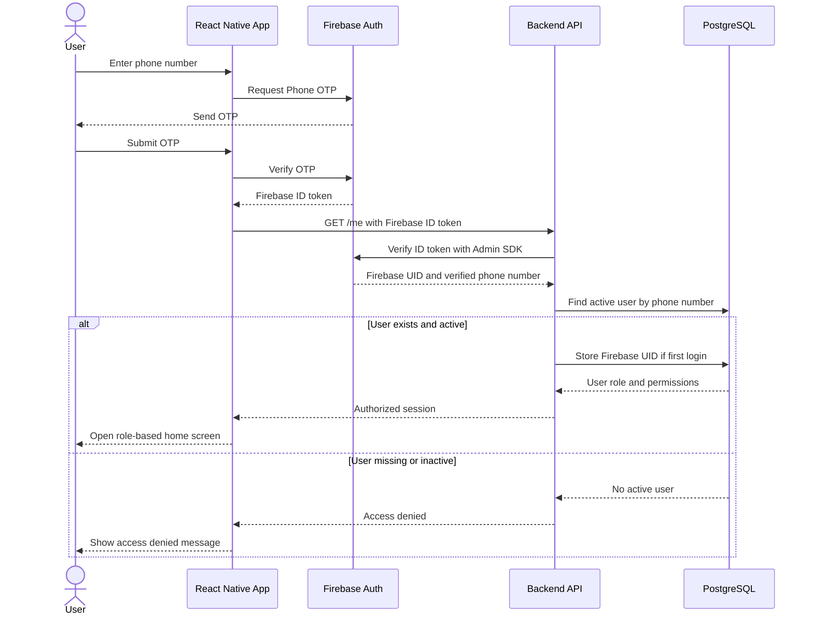
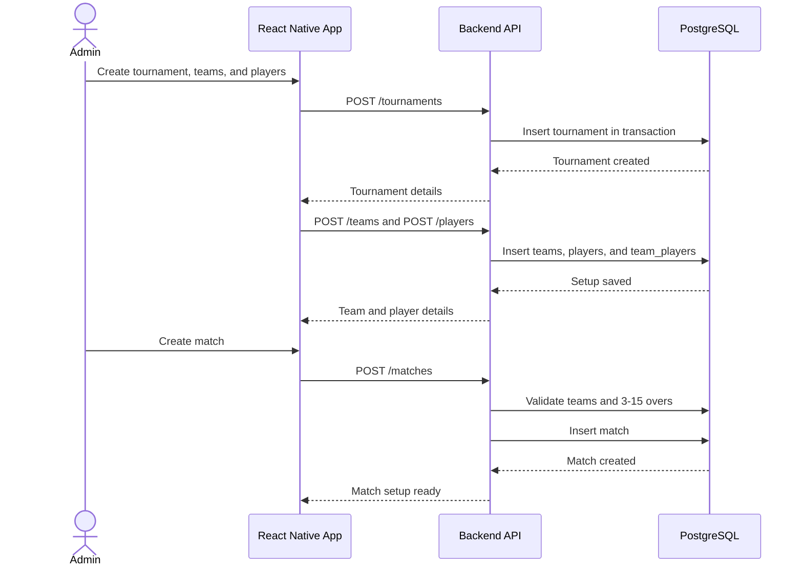
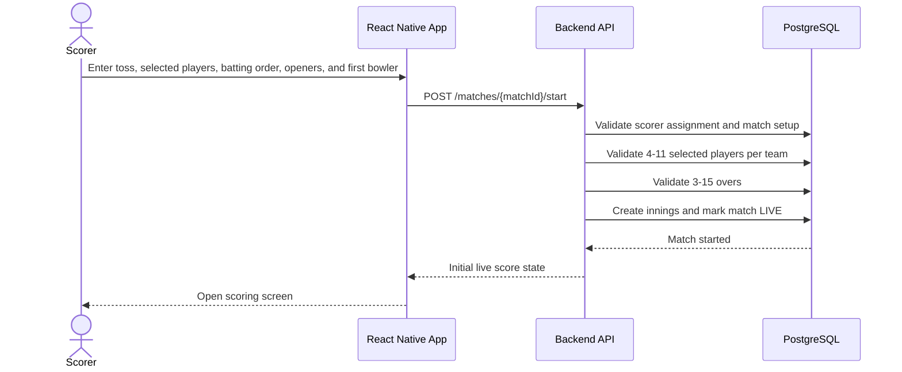
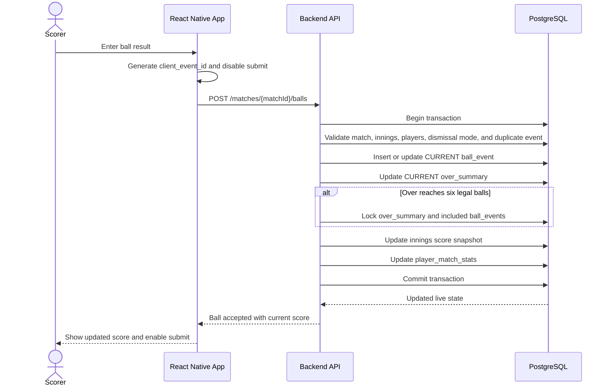
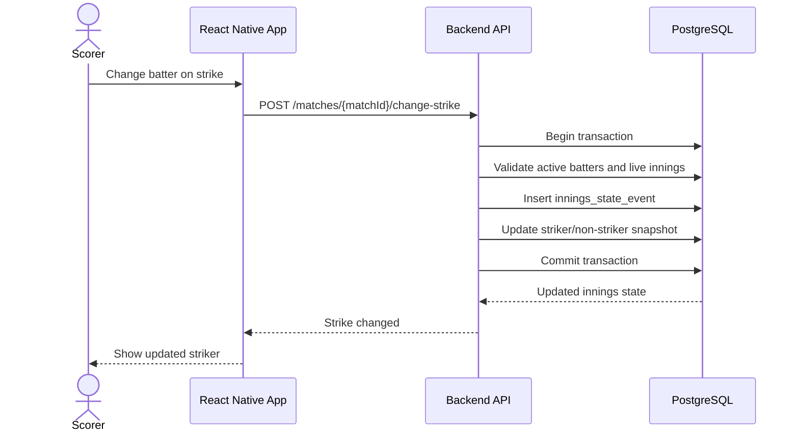
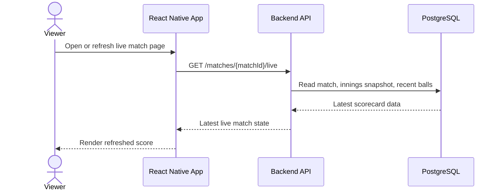
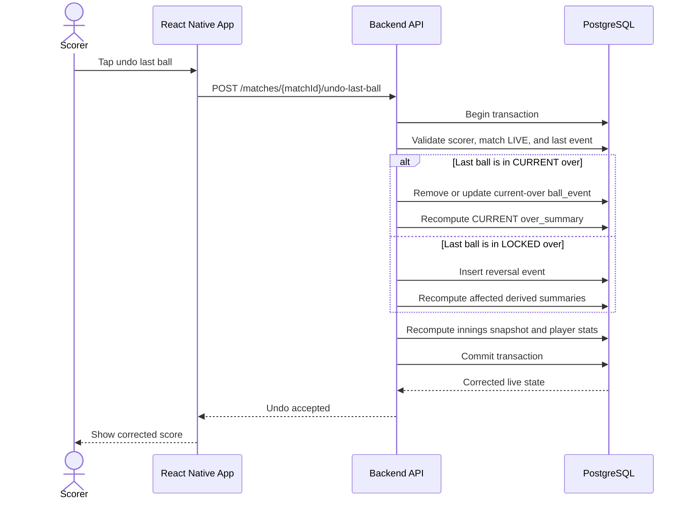
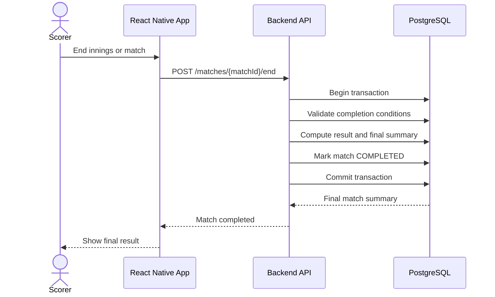

# Cricket Scoring Mobile App PRD

## 1) Objective

Build a React Native cricket scoring mobile app where authorized scorers can create matches and score ball-by-ball, while viewers can follow live scores, match summaries, and basic stats by refreshing the match view.

The MVP should be free to start, but the product must be designed so it can move to paid infrastructure without rewriting the app.

---

## 2) Goals and Success Metrics

### Product Goals

- Let an admin onboard permitted users by phone number.
- Let admins create tournaments, teams of 4-11 players, players, and matches.
- Let an authorized scorer record a complete cricket innings ball-by-ball.
- Let viewers refresh the match view to see the latest score, scorecard, and match status.
- Preserve an immutable scoring history so corrections, audits, and summaries are reliable.

### MVP Success Metrics

- Scorer can complete a 15-over match without app restart or data loss.
- Viewer sees the latest score within 1 second after manually refreshing under MVP load.
- Duplicate ball submissions are rejected or safely ignored.
- Admin-only actions cannot be performed by viewer accounts.
- Match summary is generated correctly for normal completion, all out, and chase completion.

### Initial Usage Assumption

- Initial active user base: 15-30 users.
- Expected concurrent users during a match: 5-20.
- Viewers do not need automatic push/live streaming in MVP.
- Viewer screens should load the latest score when opened or manually refreshed.
- Auto-refresh may be added later as an optional enhancement, for example every 15-30 seconds on the live match page.

---

## 3) Recommended Stack for This MVP

Because the first release is for 15-30 users and viewers only need latest data after refresh, the app does not require full realtime subscriptions for every viewer. A simple API-backed architecture is enough and may be easier to reason about.

### Preferred Stack

- **Mobile App:** Expo, React Native, TypeScript
- **UI/Styling:** Tamagui, React Native SVG, Expo Vector Icons
- **Navigation:** React Navigation
- **State + Server Cache:** Zustand + TanStack Query
- **Authentication:** Firebase Auth Phone OTP
- **Backend API:** Node.js with NestJS or Express
- **Database:** PostgreSQL
- **ORM:** Prisma
- **Hosting:** Render, Railway, Fly.io, or a low-cost VPS when needed
- **Storage:** Not required for MVP unless player/team images are added
- **CI/CD:** GitHub Actions

### Why This Stack Fits the Current Scope

- Firebase Auth handles Phone OTP without building SMS verification from scratch.
- Backend verifies Firebase ID tokens and maps the verified phone number to a local user record.
- Expo React Native gives faster UI iteration and keeps the option open for iOS later.
- Tamagui supports a minimalist, vibrant design system with reusable typed tokens.
- TanStack Query keeps refresh-based score views simple and reliable.
- PostgreSQL is better for cricket scoring consistency, transactions, scorecards, and reporting queries.
- Refresh-based viewer screens can use normal REST APIs without realtime listeners.
- Backend rules stay centralized and easier to test.
- Costs remain very low for 15-30 users.
- It is easier to add WebSockets or Server-Sent Events later only if the product actually needs automatic live updates.

---

## 4) Architecture Decision

Use **Firebase Auth Phone OTP for authentication** and keep **Node.js + PostgreSQL for app data and scoring**.

### Authentication Boundary

- Firebase owns OTP sending, OTP verification, and Firebase ID token creation.
- Backend API owns app authorization, role checks, user activation, tournament access, and scoring permissions.
- PostgreSQL stores app users, roles, tournaments, teams, matches, innings, ball events, stats, and audit logs.
- PostgreSQL must not store OTP codes or Firebase secrets.

### Login Rule

- A Firebase-authenticated user is not automatically allowed into the app.
- The backend must check that the verified phone number exists in PostgreSQL and has `active` status.
- If the phone number is missing or inactive, the backend returns access denied even if Firebase OTP verification succeeded.

---

## 5) Free Tier Reality Check

Free tiers are useful for MVPs, but they are not guaranteed free at production traffic.

- Firebase Auth, Render, Railway, Fly.io, and similar platforms all have usage, uptime, or resource limits.
- Phone OTP may require billing setup depending on region, abuse protection, and project settings.
- Managed backend functions, databases, and hosting may require billing once usage grows.
- Manual refresh keeps MVP costs lower than always-on realtime listeners.
- Heavy live score traffic can exceed free quotas quickly if auto-refresh or realtime is enabled later.

### Cost Control Strategy

- Store one denormalized current score snapshot per match for viewer screens.
- Avoid forcing viewers to subscribe to the full ball event log.
- Keep completed overs immutable, but allow scorer edits within the current in-progress over.
- Rate-limit privileged backend APIs by user and match.
- Use pagination for historical ball-by-ball views.
- Monitor API, database, and auth usage from the first test tournament.

---

## 6) Product Scope

### MVP

- OTP login
- Admin-approved user access
- Roles: super admin, tournament admin, scorer, viewer
- User activation/deactivation
- Tournament creation
- Team and player creation
- Team size support from 4 to 11 players
- Match overs support from 3 to 15 overs
- Match creation
- Toss, selected players, batting order, and bowler setup
- Start, pause, resume, and end match
- Ball-by-ball scoring
- Persist every current-over ball and score update in the database
- Persist each completed over as immutable in the database
- Runs, wickets, wides, no-balls, byes, leg byes, penalty runs
- Strike rotation and over progression
- Manual striker change when scorer needs to correct strike before the next ball
- Wicket dismissal mode selection
- Undo last ball without requiring a reason
- Viewer live score page
- Match summary and basic player stats

### Out of Scope for MVP

- Payments or subscriptions
- Fantasy cricket
- Public social feeds
- Video streaming
- Advanced wagon wheel, pitch map, or ball tracking
- Multi-language support
- Native iOS app
- Automatic ball-by-ball push updates for all viewers

---

## 7) User Roles and Permissions

| Role | Permissions |
| --- | --- |
| Super Admin | Manage all users, tournaments, roles, and system settings. |
| Tournament Admin | Manage assigned tournaments, teams, players, and matches. |
| Scorer | Score assigned matches and perform allowed corrections. |
| Viewer | Read public or permitted tournament/match data only. |

Role checks must be enforced by the backend API and database authorization rules where applicable. Client-side role checks are only for UI visibility and must not be trusted for authorization.

---

## 8) Functional Requirements

### FR-1 User Onboarding and Authorization

- Admin adds a user's phone number before the user can access the app.
- User logs in with Firebase Phone OTP.
- React Native app sends the Firebase ID token to the backend.
- Backend verifies the Firebase ID token with Firebase Admin SDK.
- Backend maps the verified phone number to an active PostgreSQL user record.
- If the phone number is not found or the user is inactive, access is denied.
- Users can be deactivated without deleting historical audit data.

### FR-2 Role Management

- Super admin can assign or change any role.
- Tournament admin can assign scorers and viewers only within their tournaments.
- Viewer cannot access admin, tournament setup, or scoring actions.
- Role changes are audited with actor, timestamp, old role, and new role.

### FR-3 Tournament, Team, and Player Setup

- Admin can create tournaments with name, season, start date, end date, and status.
- Admin can create teams and assign players to teams.
- A team must have at least 4 players and at most 11 players for MVP matches.
- Player profile includes name, phone number optional, batting style optional, bowling style optional.
- Match setup includes tournament, teams, overs, venue, scheduled date/time, and match type.
- Match overs must be at least 3 overs and at most 15 overs.

### FR-4 Match Start

- Scorer/admin enters toss result, elected option, selected players, batting order, openers, and first bowler.
- Backend validates that required match setup is complete.
- Backend validates that each match team has 4-11 selected players.
- Backend validates that match overs are between 3 and 15.
- Backend marks match as `LIVE` and initializes innings state.
- Match cannot be started twice.

### FR-5 Ball-by-Ball Scoring

- Scorer can record each delivery with:
  - striker
  - non-striker
  - bowler
  - bat runs
  - extras type and extra runs
  - dismissal mode and dismissed player, when applicable
  - fielder involved, when applicable
  - next batter, when applicable
- Backend validates match state, innings state, legal delivery count, striker/bowler eligibility, and duplicate event IDs.
- Backend updates score, wickets, overs, strike, batting stats, bowling stats, extras, and the current score snapshot.
- Backend saves every current-over ball and score update in the database.
- Backend allows scorer edits to balls and scores only while the over is still in progress.
- Backend updates or creates the current over summary after each ball or current-over edit.
- Backend marks an over summary as completed when six legal balls are recorded for that over.
- Once an over is completed and saved, its over summary and included locked ball events become immutable.

### FR-6 Strike and Batter Controls

- Scorer can manually change the batter on strike before recording the next ball.
- Manual striker change must swap striker and non-striker only among active batters at the crease.
- Manual striker change creates an audit event and updates the current innings snapshot.
- Manual striker change cannot be used after match completion.
- Backend validates that both selected batters are active, not dismissed, and part of the batting team.

### FR-7 Dismissal Modes

- Supported dismissal modes for MVP:
  - bowled
  - caught
  - caught behind
  - LBW
  - run out
  - stumped
  - hit wicket
  - retired out
- Wicket input must capture dismissed player.
- Caught, caught behind, run out, and stumped may capture the fielder involved when known.
- Run out must allow either striker or non-striker as the dismissed player.
- If a wicket falls and innings continues, scorer must select the next batter before recording the next ball.

### FR-8 Cricket Rules for MVP

- Legal balls increment delivery count.
- Wides and no-balls do not increment delivery count.
- Byes and leg byes increment delivery count unless combined with no-ball according to supported rules.
- Odd completed runs rotate strike.
- End of over rotates strike after applying delivery result.
- Wicket handling supports bowled, caught, caught behind, LBW, run out, stumped, hit wicket, and retired out.
- Innings ends when overs are complete, available wickets fall, target is chased, or scorer/admin ends innings manually.
- Available wickets for an innings equal selected team size minus 1, so a 4-player team is all out after 3 wickets and an 11-player team is all out after 10 wickets.
- Super over, DLS, retired hurt, substitutions, and penalties beyond basic penalty runs are out of scope for MVP unless added later.

### FR-9 Corrections

- Scorer can undo the last ball only while the match is live and before the next innings starts.
- Undo last ball must not require the scorer to enter a reason.
- Undo can directly remove or update the last ball while the current over is still in progress.
- If the last ball belongs to a completed saved over, undo creates an append-only reversal/audit event rather than mutating the saved over.
- Undo recomputes the innings snapshot, player stats, and affected current or completed over summary from the remaining valid ball events.
- Non-last-ball corrections are out of scope for MVP and should be handled by admin support workflow.

### FR-10 Match Completion

- Admin/scorer can end an innings or match when valid completion conditions are met.
- Backend computes result: winner, margin, tie, no result, or abandoned.
- Backend writes final match summary and player stat aggregates.
- Completed matches become read-only except for super admin correction tools in future phases.

### FR-11 Viewer Experience

- Viewer can browse upcoming, live, and completed matches.
- Viewer can open a live match and see the latest score from the backend.
- Viewer can manually refresh the live match page to fetch the latest score.
- App may support optional auto-refresh later, but this is not required for MVP.
- Viewer can see score, overs, wickets, current batters, current bowler, recent balls, and required run rate when applicable.
- Viewer can open match summary and basic player stats after completion.

---

## 9) Non-Functional Requirements

- Scorer action persistence target: less than 1 second at p95 for MVP load.
- Viewer refresh response target: less than 1 second at p95 for 15-30 users.
- Scoring requests must be idempotent using client-generated event IDs.
- Privileged writes must go through backend APIs with server-side authorization.
- Crash-free sessions target: greater than 99%.
- Scorer screen should tolerate temporary network loss by queueing one pending event at a time.
- Offline scoring must prevent parallel unsynced events from multiple devices for the same match.
- App must show clear sync status: synced, saving, failed, offline.
- Database indexes must be defined for match list, live match, scorecard, and ball event queries before launch.

---

## 10) PostgreSQL Data Model

### Core Tables

- `users`
  - `id UUID PK`
  - `firebase_uid TEXT UNIQUE NULL`
  - `phone_number TEXT UNIQUE NOT NULL`
  - `display_name TEXT NOT NULL`
  - `role user_role NOT NULL`
  - `status user_status NOT NULL`
  - `created_by UUID FK users.id NULL`
  - `created_at TIMESTAMPTZ NOT NULL`
  - `updated_at TIMESTAMPTZ NOT NULL`
- `tournaments`
  - `id UUID PK`
  - `name TEXT NOT NULL`
  - `season TEXT NULL`
  - `status tournament_status NOT NULL`
  - `start_date DATE NULL`
  - `end_date DATE NULL`
  - `created_by UUID FK users.id NOT NULL`
  - `created_at TIMESTAMPTZ NOT NULL`
  - `updated_at TIMESTAMPTZ NOT NULL`
- `teams`
  - `id UUID PK`
  - `tournament_id UUID FK tournaments.id NOT NULL`
  - `name TEXT NOT NULL`
  - `short_name TEXT NULL`
  - `created_at TIMESTAMPTZ NOT NULL`
  - `updated_at TIMESTAMPTZ NOT NULL`
- `players`
  - `id UUID PK`
  - `name TEXT NOT NULL`
  - `phone_number TEXT NULL`
  - `batting_style batting_style NULL`
  - `bowling_style bowling_style NULL`
  - `created_at TIMESTAMPTZ NOT NULL`
  - `updated_at TIMESTAMPTZ NOT NULL`
- `team_players`
  - `team_id UUID FK teams.id NOT NULL`
  - `player_id UUID FK players.id NOT NULL`
  - `shirt_number INTEGER NULL`
  - `status team_player_status NOT NULL`
  - `created_at TIMESTAMPTZ NOT NULL`
- `match_team_players`
  - `match_id UUID FK matches.id NOT NULL`
  - `team_id UUID FK teams.id NOT NULL`
  - `player_id UUID FK players.id NOT NULL`
  - `batting_order INTEGER NULL`
  - `is_playing BOOLEAN NOT NULL`
  - `created_at TIMESTAMPTZ NOT NULL`
- `matches`
  - `id UUID PK`
  - `tournament_id UUID FK tournaments.id NOT NULL`
  - `team_a_id UUID FK teams.id NOT NULL`
  - `team_b_id UUID FK teams.id NOT NULL`
  - `match_type match_type NOT NULL`
  - `status match_status NOT NULL`
  - `overs_limit INTEGER NOT NULL`
  - `venue TEXT NULL`
  - `scheduled_at TIMESTAMPTZ NULL`
  - `toss_winner_team_id UUID FK teams.id NULL`
  - `toss_decision toss_decision NULL`
  - `current_innings_no INTEGER NULL`
  - `result_type result_type NULL`
  - `winner_team_id UUID FK teams.id NULL`
  - `result_summary TEXT NULL`
  - `created_at TIMESTAMPTZ NOT NULL`
  - `updated_at TIMESTAMPTZ NOT NULL`
- `innings`
  - `id UUID PK`
  - `match_id UUID FK matches.id NOT NULL`
  - `innings_no INTEGER NOT NULL`
  - `batting_team_id UUID FK teams.id NOT NULL`
  - `bowling_team_id UUID FK teams.id NOT NULL`
  - `status innings_status NOT NULL`
  - `score INTEGER NOT NULL DEFAULT 0`
  - `wickets INTEGER NOT NULL DEFAULT 0`
  - `legal_balls INTEGER NOT NULL DEFAULT 0`
  - `extras_total INTEGER NOT NULL DEFAULT 0`
  - `wides INTEGER NOT NULL DEFAULT 0`
  - `no_balls INTEGER NOT NULL DEFAULT 0`
  - `byes INTEGER NOT NULL DEFAULT 0`
  - `leg_byes INTEGER NOT NULL DEFAULT 0`
  - `penalty_runs INTEGER NOT NULL DEFAULT 0`
  - `striker_id UUID FK players.id NULL`
  - `non_striker_id UUID FK players.id NULL`
  - `current_bowler_id UUID FK players.id NULL`
  - `target_runs INTEGER NULL`
  - `created_at TIMESTAMPTZ NOT NULL`
  - `updated_at TIMESTAMPTZ NOT NULL`
- `ball_events`
  - `id UUID PK`
  - `match_id UUID FK matches.id NOT NULL`
  - `innings_id UUID FK innings.id NOT NULL`
  - `over_no INTEGER NOT NULL`
  - `ball_no INTEGER NOT NULL`
  - `event_no INTEGER NOT NULL`
  - `client_event_id TEXT NOT NULL`
  - `status ball_event_status NOT NULL`
  - `striker_id UUID FK players.id NOT NULL`
  - `non_striker_id UUID FK players.id NOT NULL`
  - `bowler_id UUID FK players.id NOT NULL`
  - `bat_runs INTEGER NOT NULL DEFAULT 0`
  - `extras_type extras_type NULL`
  - `extras_runs INTEGER NOT NULL DEFAULT 0`
  - `is_legal_delivery BOOLEAN NOT NULL`
  - `is_wicket BOOLEAN NOT NULL DEFAULT false`
  - `wicket_type wicket_type NULL`
  - `dismissed_player_id UUID FK players.id NULL`
  - `fielder_player_id UUID FK players.id NULL`
  - `next_batter_id UUID FK players.id NULL`
  - `total_runs INTEGER NOT NULL DEFAULT 0`
  - `payload JSONB NOT NULL DEFAULT '{}'::jsonb`
  - `created_by UUID FK users.id NOT NULL`
  - `created_at TIMESTAMPTZ NOT NULL`
  - `updated_at TIMESTAMPTZ NOT NULL`
  - `reversal_of_event_id UUID FK ball_events.id NULL`
- `over_summaries`
  - `id UUID PK`
  - `match_id UUID FK matches.id NOT NULL`
  - `innings_id UUID FK innings.id NOT NULL`
  - `over_no INTEGER NOT NULL`
  - `status over_status NOT NULL`
  - `runs INTEGER NOT NULL DEFAULT 0`
  - `wickets INTEGER NOT NULL DEFAULT 0`
  - `legal_balls INTEGER NOT NULL DEFAULT 0`
  - `extras_total INTEGER NOT NULL DEFAULT 0`
  - `bowler_id UUID FK players.id NOT NULL`
  - `ball_event_ids UUID[] NOT NULL DEFAULT '{}'`
  - `summary JSONB NOT NULL DEFAULT '{}'::jsonb`
  - `locked_at TIMESTAMPTZ NULL`
  - `created_at TIMESTAMPTZ NOT NULL`
  - `updated_at TIMESTAMPTZ NOT NULL`
- `innings_state_events`
  - `id UUID PK`
  - `match_id UUID FK matches.id NOT NULL`
  - `innings_id UUID FK innings.id NOT NULL`
  - `event_type innings_state_event_type NOT NULL`
  - `payload JSONB NOT NULL`
  - `created_by UUID FK users.id NOT NULL`
  - `created_at TIMESTAMPTZ NOT NULL`
- `player_match_stats`
  - `match_id UUID FK matches.id NOT NULL`
  - `player_id UUID FK players.id NOT NULL`
  - `runs_scored INTEGER NOT NULL DEFAULT 0`
  - `balls_faced INTEGER NOT NULL DEFAULT 0`
  - `fours INTEGER NOT NULL DEFAULT 0`
  - `sixes INTEGER NOT NULL DEFAULT 0`
  - `is_out BOOLEAN NOT NULL DEFAULT false`
  - `dismissal_type wicket_type NULL`
  - `balls_bowled INTEGER NOT NULL DEFAULT 0`
  - `runs_conceded INTEGER NOT NULL DEFAULT 0`
  - `wickets_taken INTEGER NOT NULL DEFAULT 0`
  - `catches INTEGER NOT NULL DEFAULT 0`
  - `run_outs INTEGER NOT NULL DEFAULT 0`
  - `stumpings INTEGER NOT NULL DEFAULT 0`
  - `updated_at TIMESTAMPTZ NOT NULL`
- `audit_logs`
  - `id UUID PK`
  - `actor_user_id UUID FK users.id NOT NULL`
  - `action audit_action NOT NULL`
  - `entity_type TEXT NOT NULL`
  - `entity_id UUID NOT NULL`
  - `before_payload JSONB NULL`
  - `after_payload JSONB NULL`
  - `created_at TIMESTAMPTZ NOT NULL`

### PostgreSQL Enums

- `user_role`: `SUPER_ADMIN`, `TOURNAMENT_ADMIN`, `SCORER`, `VIEWER`
- `user_status`: `ACTIVE`, `INACTIVE`
- `tournament_status`: `DRAFT`, `ACTIVE`, `COMPLETED`, `ARCHIVED`
- `team_player_status`: `ACTIVE`, `INACTIVE`
- `match_type`: `FRIENDLY`, `TOURNAMENT`, `PRACTICE`
- `match_status`: `SCHEDULED`, `LIVE`, `PAUSED`, `INNINGS_BREAK`, `COMPLETED`, `ABANDONED`
- `innings_status`: `NOT_STARTED`, `LIVE`, `COMPLETED`
- `ball_event_status`: `CURRENT`, `LOCKED`, `REVERSED`
- `over_status`: `CURRENT`, `LOCKED`
- `extras_type`: `WIDE`, `NO_BALL`, `BYE`, `LEG_BYE`, `PENALTY`
- `wicket_type`: `BOWLED`, `CAUGHT`, `CAUGHT_BEHIND`, `LBW`, `RUN_OUT`, `STUMPED`, `HIT_WICKET`, `RETIRED_OUT`
- `toss_decision`: `BAT`, `BOWL`
- `result_type`: `TEAM_A_WON`, `TEAM_B_WON`, `TIE`, `NO_RESULT`, `ABANDONED`
- `batting_style`: `RIGHT_HAND`, `LEFT_HAND`
- `bowling_style`: `RIGHT_ARM_FAST`, `RIGHT_ARM_MEDIUM`, `RIGHT_ARM_SPIN`, `LEFT_ARM_FAST`, `LEFT_ARM_MEDIUM`, `LEFT_ARM_SPIN`
- `innings_state_event_type`: `MANUAL_STRIKE_CHANGE`, `BATTER_CHANGE`, `BOWLER_CHANGE`, `INNINGS_STARTED`, `INNINGS_ENDED`
- `audit_action`: `CREATE`, `UPDATE`, `DEACTIVATE`, `START_MATCH`, `RECORD_BALL`, `UPDATE_CURRENT_OVER_BALL`, `UNDO_LAST_BALL`, `CHANGE_STRIKE`, `END_INNINGS`, `END_MATCH`

Use PostgreSQL enums for controlled workflow/status values that are unlikely to change often. Use lookup tables instead of enums if admins need to customize values from the app.

### Design Rules

- Save every current-over delivery and scoring action in `ball_events`, including legal balls, wides, no-balls, wickets, and extras.
- `ball_events.status` values should include `CURRENT`, `LOCKED`, and `REVERSED`.
- Current-over `ball_events` may be updated while their `over_summaries.status` is `CURRENT`.
- Once an over is completed, set its `over_summaries.status` to `LOCKED`, set `locked_at`, and set included `ball_events.status` to `LOCKED`.
- Locked ball events and locked over summaries must not be edited directly.
- Undo within a `CURRENT` over may update or remove the current-over ball event and recompute the current over summary.
- Undo against a `LOCKED` over must be append-only: insert a reversal event whose `reversal_of_event_id` points to the original ball event, then recompute derived snapshots.
- Store one `over_summaries` row per innings over for fast scorecard and viewer reads.
- Keep `over_summaries` derived from effective ball events, excluding events removed in the current over or undone by reversal events.
- Store a denormalized current score snapshot in `innings` and `matches` for fast refresh reads.
- Use transactions for scoring updates so ball event creation, over summary update, innings snapshot update, and stat updates succeed or fail together.
- Enforce a unique constraint on `client_event_id` per match to prevent duplicate scoring.
- Prefer aggregate stat updates inside the same backend transaction as confirmed scoring events.
- Do not store sensitive auth secrets or OTP data in the application database.
- Store `firebase_uid` after the user's first successful backend authorization, so future lookups can use both UID and phone number.
- Enforce unique constraints for `users.phone_number` and `users.firebase_uid` when present.
- Enforce a database check constraint for `matches.overs_limit` between 3 and 15.
- Enforce `matches.team_a_id <> matches.team_b_id`.
- Enforce unique `team_players(team_id, player_id)`, `match_team_players(match_id, team_id, player_id)`, `innings(match_id, innings_no)`, `ball_events(match_id, client_event_id)`, and `over_summaries(innings_id, over_no)`.
- Validate 4-11 selected players per team before a match can start.
- Validate `overs_limit` between 3 and 15 before a match can be created or started.
- Store dismissal mode in `ball_events.wicket_type`, dismissed player in `dismissed_player_id`, optional fielder in `fielder_player_id`, and extra details in `payload`.
- Enforce that `wicket_type` and `dismissed_player_id` are present when `is_wicket = true`, and null when `is_wicket = false`.
- Enforce that `extras_type` is present when `extras_runs > 0`, except when all runs are bat runs.
- Store manual striker changes as `innings_state_events` so they are auditable without pretending they were deliveries.
- Add indexes for `matches(tournament_id, status, scheduled_at)`, `innings(match_id)`, `ball_events(match_id, innings_id, event_no)`, and `over_summaries(match_id, innings_id, over_no)`.

---

## 11) Backend API Contracts

- `addUser(phoneNumber, role, displayName?)`
- `getMe()`
- `updateUserRole(userId, role)`
- `deactivateUser(userId)`
- `createTournament(payload)`
- `createTeam(tournamentId, payload)`
- `createPlayer(payload)`
- `createMatch(payload)`
- `startMatch(matchId, tossInfo, selectedPlayers, battingOrder, openers, firstBowler)`
- `recordBall(matchId, inningsNo, eventId, ballEvent)`
- `updateCurrentOverBall(matchId, inningsNo, ballEventId, ballEvent)`
- `changeStrike(matchId, inningsNo, strikerId, nonStrikerId)`
- `undoLastBall(matchId)`
- `endInnings(matchId, inningsNo, reason)`
- `endMatch(matchId, reason)`
- `getMatchSummary(matchId)`
- `getPlayerStats(playerId)`

All privileged endpoints must:

- Verify Firebase ID token with Firebase Admin SDK.
- Verify role and tournament/match assignment from the database.
- Reject authenticated Firebase users whose phone number is missing or inactive in PostgreSQL.
- Validate required payload fields.
- Validate enum fields such as `match_type`, `wicket_type`, `extras_type`, statuses, and toss decision before writing to the database.
- Validate match state transitions.
- Use transactions for scoring mutations.
- Return structured errors that the React Native app can display.

---

## 12) Mermaid Sequence Flow Diagrams

### Login and Authorization Flow



### Tournament and Match Setup Flow



### Match Start Flow



### Ball-by-Ball Scoring Flow



### Manual Striker Change Flow



### Viewer Refresh Flow



### Undo Last Ball Flow



### Match Completion Flow



---

## 13) React Native App Architecture

### App Modules

- `auth`: OTP login and backend authorization check
- `admin`: users, roles, tournaments, teams, players, and match setup
- `scoring`: scoring screen, undo, innings controls, and sync status
- `viewer`: match list, live score screen, scorecard, and stats
- `core`: API client, app config, shared types, storage, logging, utilities, and design system

### State and Data Pattern

- Use TanStack Query for API calls, server cache, refresh, retries, and loading/error states.
- Use Zustand for lightweight local UI state, scoring draft state, and session-adjacent state that does not belong in the server cache.
- Use typed API clients and shared request/response types where possible.
- Keep scoring actions explicit, for example `recordBall`, `updateCurrentOverBall`, `changeStrike`, and `undoLastBall`.
- Optimistic UI allowed only after local validation and must rollback on backend failure.
- Scoring screen must disable duplicate submit while a ball event is pending.

---

## 14) UI and Design System

### Visual Direction

- UI should be minimalist, fast to scan, and vibrant.
- Use a clean light theme by default with a dark theme supported from launch.
- Use a restrained cricket-inspired palette: deep green as primary, electric blue or teal as secondary, amber for highlights, red for wickets/errors, and neutral gray surfaces.
- Avoid heavy gradients, overly decorative cards, and dense visual clutter.
- Keep cards compact with 8dp corner radius or less.
- Use color to signal match state clearly: upcoming, live, innings break, completed, wicket, error, and synced.

### React Native Styling Frameworks

- Use **Tamagui** as the primary UI/styling framework.
- Use typed design tokens for color, spacing, radius, typography, and shadows.
- Use **React Navigation** for screen routing.
- Use **Expo Vector Icons** or Lucide-compatible icon assets for consistent iconography.
- Use **React Native SVG** only for purposeful custom visuals or score symbols.
- Avoid unnecessary native dependencies unless Expo config plugins cover them cleanly.

### Key UI Requirements

- Scoring screen must prioritize speed: large run buttons, clear extras controls, wicket flow, dismissal mode picker, strike-change control, undo, and visible sync status.
- Wicket flow should use concise chips or segmented choices for bowled, caught, caught behind, LBW, run out, stumped, hit wicket, and retired out.
- Manual striker change should be available as a clear scorer control, separate from normal automatic strike rotation.
- Viewer live screen must show score, overs, wickets, batters, bowler, recent balls, and refresh action without visual noise.
- Admin setup forms must use step-based screens for tournament, teams, players, match, selected players, and toss setup.
- Buttons, chips, segmented controls, dropdowns, switches, and dialogs should use consistent Tamagui components and tokens.
- Text must fit on small mobile screens without overlap or truncating critical scoring values.
- Use skeleton/loading states for refresh and setup screens.
- Use empty states for no tournaments, no matches, no players, and no completed scorecards.
- Error messages should be concise and actionable.

### Suggested Design Tokens

- `color.primary`: deep green
- `color.secondary`: teal or electric blue
- `color.accent`: amber
- `color.error`: red
- `color.surface`: near-white/light gray in light theme, charcoal in dark theme
- `color.success`: green
- `color.warning`: amber
- `color.live`: red or vivid coral accent
- `radius.card`: 8
- `radius.control`: 8

---

## 15) Suggested Folder Structure

### Monorepo

```text
cric/
  mobile/
  backend/
  docs/
  .github/
```

### React Native Mobile App

```text
mobile/
  app/
    _layout.tsx
    index.tsx
    auth/
    admin/
    scoring/
    viewer/
  src/
    core/
      api/
      config/
      firebase/
      storage/
      types/
      utils/
    design/
      components/
      icons/
      theme/
      tokens/
      typography/
    features/
      auth/
        components/
        hooks/
        screens/
      admin/
        users/
        tournaments/
        teams/
        players/
        matches/
      scoring/
        components/
        hooks/
        screens/
        store/
      viewer/
        match-list/
        live-score/
        scorecard/
        stats/
    navigation/
    query/
      queryClient.ts
    store/
      sessionStore.ts
  assets/
  app.config.ts
  babel.config.js
  package.json
  tamagui.config.ts
  tsconfig.json
```

### Backend API

```text
backend/
  src/
    main.ts
    app.module.ts
    config/
    auth/
      firebase-admin.service.ts
      firebase-auth.guard.ts
    users/
    tournaments/
    teams/
    players/
    matches/
    scoring/
    scorecards/
    stats/
    common/
      decorators/
      errors/
      guards/
      pipes/
      types/
    database/
      prisma.service.ts
  prisma/
    schema.prisma
    migrations/
    seed.ts
  test/
  package.json
```

### Docs and Delivery

```text
docs/
  CRIC_PRD.md
  api-contracts.md
  scoring-rules.md
  database-schema.md
.github/
  workflows/
    mobile-ci.yml
    backend-ci.yml
```

---

## 16) Security Requirements

- Backend authorization enforces write permissions by role and assignment.
- Backend verifies Firebase ID tokens on every protected request.
- Database constraints protect scoring integrity where possible.
- Use Firebase App Check where practical and server-side token verification for production abuse protection.
- Audit fields required for sensitive writes: `actorUid`, `timestamp`, `action`, `targetId`.
- Users cannot self-promote roles or reactivate themselves.
- Viewer reads should be limited to tournament/match data intended for that viewer.
- Use least-privilege service account permissions for backend automation.

---

## 17) Analytics and Monitoring

- Track login success/failure.
- Track match created, match started, ball recorded, undo used, and match completed.
- Track scoring failures by error type.
- Track live match viewer count approximation.
- Monitor API requests and database reads/writes per live match.
- Monitor backend API latency and error rates.
- Use Crashlytics for fatal and non-fatal scoring screen errors.

---

## 18) Milestones

### Phase 0: Product and Backend Setup, 1 week

- Confirm cricket rule scope.
- Create Firebase project, Expo React Native app, backend API, and database project.
- Define PostgreSQL schema and authorization approach.
- Set up CI, linting, and basic app shell.

### Phase 1: MVP, 6-8 weeks

- Auth and admin-approved onboarding.
- Role management.
- Tournament, team, player, and match setup.
- Minimalist vibrant Tamagui design system.
- Match start flow.
- Ball-by-ball scoring and undo last ball.
- Viewer live match page.
- Match summary.
- Basic analytics and Crashlytics.

### Phase 2: Post-MVP

- Advanced stats and leaderboards.
- Better correction workflows.
- Notifications for wickets, milestones, and match results.
- Rich scorecards and player profiles.
- Public tournament sharing.
- Optional auto-refresh, WebSocket, or Server-Sent Events support from the backend API.

---

## 19) Risks and Open Questions

- Phone OTP cost and availability must be verified before launch region is finalized.
- Offline scoring is risky if multiple scorers can access the same match; MVP should allow only one active scorer per match.
- Realtime costs are avoided in MVP by using manual refresh, but future auto-refresh, WebSocket, or Server-Sent Events should be cost-tested.
- Cricket rule complexity can expand rapidly; MVP must keep an explicit supported-rules list.
- Need decision on whether viewers are public, invite-only, or tournament-scoped.
- Need decision on whether teams/players are tournament-specific or reusable globally.
- Need final brand colors and app name before high-fidelity UI design starts.

---

## 20) Cost Plan

### Start Free

- Firebase Spark plan where available.
- Render free/low-cost tier, Railway trial credits, Fly.io, or local VPS can be considered for the backend.
- GitHub free plan.
- Expo local builds and EAS internal distribution when needed.

### Upgrade Triggers

- Phone OTP requires billing or quota increase.
- Hosted backend/database requires paid tier for uptime, storage, or higher usage.
- API/database requests exceed free quota consistently.
- Viewer concurrency grows beyond private tournament usage.
- Need production abuse protection and higher reliability expectations.

---

## 21) Final Recommendation

Use Expo React Native, TypeScript, Tamagui, Firebase Auth Phone OTP, a Node.js/NestJS backend, and PostgreSQL for the MVP. This best matches the initial 15-30 user scale, supports fast UI iteration, and keeps iOS open for later without changing the backend.

Before implementation starts, finalize the supported cricket rules, viewer access model, and one-active-scorer policy. Those decisions have the largest impact on data modeling, cost, and scoring correctness.
